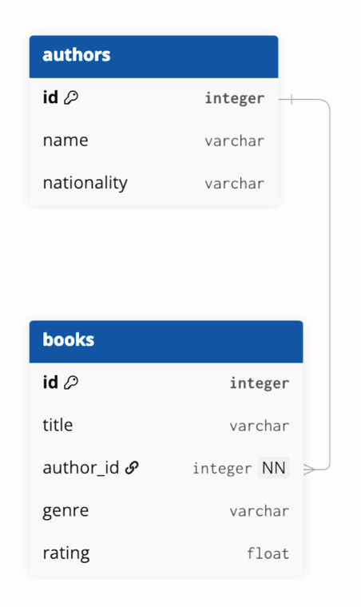

# COMP3011 Book Analytics API

A Flask-based REST API for managing and analysing book metadata. This project was developed for **COMP3011 – Web Services and Web Data** and demonstrates CRUD operations, JWT authentication, relational database modelling, dataset integration, and analytics endpoints.

## Features

- CRUD operations for books
- JWT authentication for protected write operations
- Filtering, sorting, and pagination on `/books`
- Analytics endpoints including recommendations, top-rated books, and genre statistics
- Relational modelling between **authors** and **books**
- Automated tests with `pytest`
- Swagger / OpenAPI documentation via Flask-RESTX
- SQLite database with SQLAlchemy and Flask-Migrate

## Tech Stack

- Python
- Flask
- Flask-RESTX
- SQLAlchemy
- SQLite
- Flask-JWT-Extended
- Flask-Migrate
- Pytest

## Project Structure

```text
app/
  __init__.py
  config.py
  routes.py
  extensions/
    db.py
    jwt.py
  models/
    __init__.py
    author.py
    book.py
  resources/
    analytics.py
    auth.py
    authors.py
    books.py
scripts/
  import_dataset.py
  populate_authors.py
tests/
  conftest.py
  test_analytics.py
  test_auth.py
  test_books.py
docs/
  api-documentation.pdf
  database_schema.png
instance/
  books.db
migrations/
```
## Database Schema

The API uses a relational database structure linking authors and books through a one-to-many relationship.

Authors → Books

- One author can have multiple books
- Each book references its author using a foreign key



## Setup and Installation

Follow the steps below to run the API locally.

### 1. Clone the repository

```bash
git clone https://github.com/YOUR_USERNAME/comp3011-book-analytics-api.git
cd comp3011-book-analytics-api
```

### 2. Create a virtual environment

```bash
python3 -m venv .venv
```

Activate the virtual environment:

**Mac / Linux**
```bash
source .venv/bin/activate
```

**Windows**
```bash
.venv\Scripts\activate
```

### 3. Install project dependencies

```bash
pip install -r requirements.txt
```

### 4. Configure the Flask application

Set the Flask entry point:

```bash
export FLASK_APP=run.py
```

### 5. Apply database migrations

```bash
flask db upgrade
```

### 6. Import the dataset

```bash
python scripts/import_dataset.py
```

### 7. Populate authors

```bash
python scripts/populate_authors.py
```

### 8. Run the API

```bash
python run.py
```

The API will run locally at:

http://127.0.0.1:5000

## Running Tests

Run the automated test suite with:

```bash
pytest -q
```

The tests cover:

- authentication behaviour
- CRUD operations
- analytics endpoints
- pagination behaviour

## API Documentation

Interactive Swagger documentation is available locally at:

http://127.0.0.1:5000/docs

The coursework API documentation PDF is stored in:

```
docs/api-documentation.pdf
```

## Authentication

Write operations are protected using JWT authentication.

### Get a token

Send a POST request to:

```
/auth/login
```

Example request body:

```json
{
  "username": "demo",
  "password": "demo"
}
```

Example response:

```json
{
  "access_token": "<JWT_TOKEN>",
  "token_type": "bearer"
}
```

### Use the token

Pass the token in the Authorization header:

```
Authorization: Bearer <JWT_TOKEN>
```

Protected endpoints include:

- POST /books
- PUT /books/{id}
- DELETE /books/{id}

## Main Endpoints

### Books

- GET /books – list books with filtering, sorting, and pagination
- POST /books – create a new book
- GET /books/{id} – retrieve a single book
- PUT /books/{id} – update a book
- DELETE /books/{id} – delete a book

### Authors

- GET /authors – list authors
- GET /authors/{id}/books – retrieve all books by an author

### Analytics

- GET /analytics/recommendations?seed_book_id=&limit=
- GET /analytics/genre-stats
- GET /analytics/top-rated?limit=

### Utility

- GET /health – health check endpoint

## Example Requests

### Filter books by genre and minimum rating

```
GET /books?genre=Fantasy&min_rating=4.5&limit=10
```

### Get recommendations for a seed book

```
GET /analytics/recommendations?seed_book_id=10&limit=5
```

### Get genre statistics

```
GET /analytics/genre-stats
```

### Get all books written by one author

```
GET /authors/1/books
```

## Example Genre Statistics Response

```json
[
  {
    "genre": "Fantasy",
    "avg_rating": 4.21,
    "book_count": 152
  },
  {
    "genre": "Science Fiction",
    "avg_rating": 4.08,
    "book_count": 98
  }
]
```

## Notes

- The dataset is imported through custom scripts in scripts/.
- The author–book relationship is modelled through a foreign key from books.author_id to authors.id.
- SQLite was selected for lightweight local development and reproducibility for assessment.

## License

This repository is submitted for academic coursework purposes.
